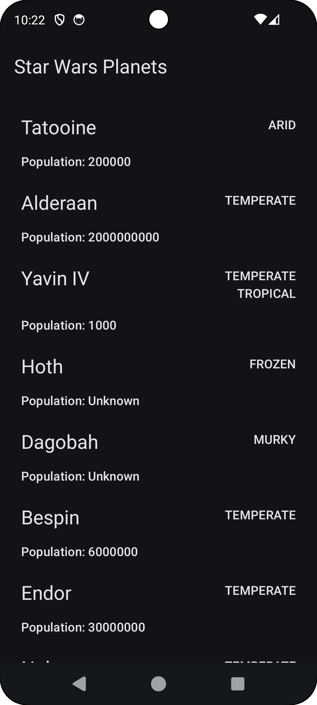
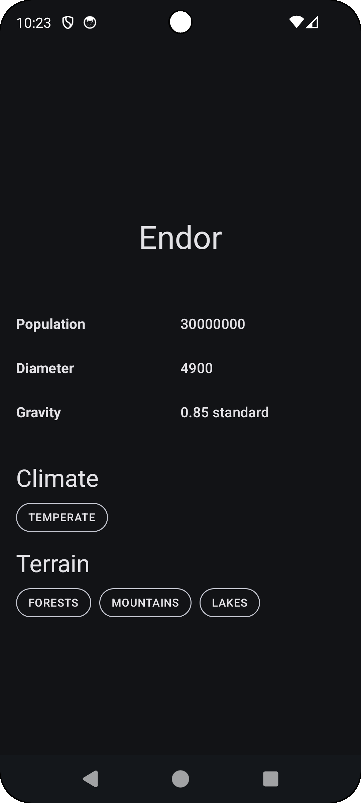

# 🌌 Star Wars Planets App

A Kotlin-based Android application that fetches and displays Star Wars planets using
the [SWAPI.tech](https://swapi.tech) API.

Whether you’re choosing an outfit to visit the Mos Eisley Cantina or heading out on a long retreat to Ahch-To, we’ve got you covered!

<p align="center">
  
  
    
</p>

## 🌍 API

This app uses [SWAPI.tech](https://swapi.tech/api/planets), a Star Wars REST API.
Two main endpoints are used:

- `GET /planets` — list of planet summaries
- `GET /planets/{id}` — full details of a single planet

## 🚀 Features

- Fetches a paginated list of planets from the Star Wars universe
- Loads detailed information for each planet
- Uses Retrofit with Kotlin Serialization for network calls
- Clean architecture with separate `feature`, `data`, and `core` modules
- Dependency injection via Hilt
- Robust testing with `MockK`, `JUnit`, and `Kotlinx Coroutines Test`

## 🧱 Architecture
The architecure follows clean architecture principles and is organised in feature modules.

__app__ : Navigation logic, application entry point

__feature__ Feature modules

__feature:planet-list__ : presentation logic for the planets list

__feature:planet-detail__ : presentation logic implementation for the planet detail

__data__

__data:planet__ : fetching logic and implementations for planet data

__core__

__core:design__ : design system and reusable UI components

__core:domain__ : use cases and repository interface contracts

__core:model__ : fundamental plain data classes defining the domain objects.

__core:network__ : base reusable http client and network settings implementation

__


## ▶️ Running the app

```bash
git clone https://github.com/your-org/star-wars-planets.git
```

## 🧪 Testing

To run tests:

```bash
./gradlew test
./gradlew \
    :feature:planet-list:connectedAndroidTest \
    :feature:planet-detail:connectedAndroidTest
```

## 🔘 Future improvements / TODOs

- [ ] Sanitise build scripts with a build-logic module
- [ ] Expand tests suite
- [ ] Add Room persistency
- [ ] Return all pages of the API with infinite scrolling
- [ ] Add colors to the team to style it in Star Wars fashion